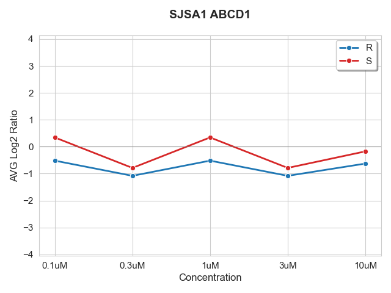

# Thermal Proteome Profiling Plotter

*Thermal Proteome Profiling Plotter* automates the visualization and filtering of thermal proteome profiling (TPP) melt curves. Thermal proteome profiling (TPP) measures protein thermal stability across temperature gradients in the presence of varying compound concentrations.

## Features

- Automated generation of TPP melt curves
- Area-based and flatness-based filtering to identify proteins of interest
- Support for single genes, gene lists, or entire proteome datasets
- Poetry for reliable dependency management

## Input Data Format

The input must be a tab-delimited file with these required columns:

| Column | Description | Example |
|--------|-------------|---------|
| `Genes` | Gene/protein identifier | `HSP90AA1` |
| `Comparison (group1/group2)` | Cell line, variant, concentration | `K562_R_10uM` |
| `# Unique Total Peptides` | Peptide count (≥2 required) | `4` |
| `AVG Log2 Ratio` | Log2 fold change value | `-0.125` |
| `Standard Error` | Standard error for error bars (optional) | `0.045` |

**Example Data:**
```
Genes   Comparison (group1/group2)  # Unique Total Peptides AVG Log2 Ratio  Standard Error
HSP90AA1    K562_R_10uM 4   -0.12   0.045
HSP90AA1    K562_S_10uM 4   0.32    0.038
HSP90AA1    K562_R_5uM  4   -0.15   0.042
HSP90AA1    K562_S_5uM  4   0.28    0.035
```

## Output

### Generated Files

- **Plots**: `{GENE_NAME}_{CELL_LINE}.png` - Individual melt curve plots
- **Filter Results**: `data/gene_list_from_filtering.txt` - Genes passing filter criteria

The `EXAMPLE.png` file shows what the output TPP plots look like:



## Configuration

### Filtering Parameters

Default filtering thresholds can be modified in the code:

```python
# Area threshold for curve separation
threshold = 2  # arbitrary units

# Flatness criterion for control curves
flatness_threshold = 0.35  # standard deviation
control_curve_name = "R"  # control variant identifier
```
The are two filtering methods used:

1. **Area Between Curves**: Calculates the absolute area between the two variant melt curves using trapezoidal integration. The concentration levels are treated as categorical variables to prevent weighting/biasing towards big concentration jumps/increases.

2. **Control Curve Flatness**: Measures stability of the control curve ("R" variant in the examples) using standard deviation.

## Installation

### Prerequisites

- Python 3.8 or higher
- [Poetry](https://python-poetry.org/docs/#installation) for dependency management

### Install Poetry

If you don't have Poetry installed:

```bash
# Linux/macOS/Windows (WSL)
curl -sSL https://install.python-poetry.org | python3 -

```

### Clone and Setup

```bash
# Clone the repository
git clone https://github.com/Jack-Coutts/tpp.git
cd tpp-plotter

# Install dependencies and create virtual environment
poetry install

```

## Usage

To run the curve flatness filtering make sure you have correctly set the name of the control curve (described above).

### Via Shell Scripts

Shell scripts `run_filter.sh`, `run_gene_list.sh`, and `run_plot_all.sh` have been created for easy use of the different features. The commands contained in these scripts need to be edited slightly according to your needs. These shell scripts assume a directory structure like the one shown below:


```
|-- data/
|   |-- data_file.tsv
    |-- gene_list.txt
|-- outputs/
    |-- filtered/
    |-- gene_list/
|-- thermal_proteome_profiling/
|   |-- __init__.py
|   |-- main.py
| -- tests/
|-- .gitignore
|-- poetry.lock
|-- pyproject.toml
|-- README.md
|-- run_filter.sh
|-- run_gene_list.sh
|-- run_plot_all.sh
|-- test.sh
```
Run the scripts with the following commands:

```Bash

# Filtering script
./run_filter.sh

# Gene list script
./run_gene_list.sh

# Plot all proteins script
./run_plot_all.sh

```

### Via Poetry & CLI


```bash
# Windows
poetry run python thermal_proteome_profiling/main.py -d <data_file> -o <output_folder> [mode options]

# MacOS
poetry run python3 thermal_proteome_profiling/main.py -d <data_file> -o <output_folder> [mode options]

```

**Required Arguments:**
- `-d, --data`: Path to input data file (tab-delimited)
- `-o, --output_folder`: Path to output directory

**Mode Options (mutually exclusive):**
- `-g, --gene <GENE_NAME>`: Plot single gene
- `-gl, --gene-list <FILE>`: Plot genes contained in a `gene_list.txt` file
- `-f, --filter`: Filter proteins and create gene list file named `gene_list_from_filtering.txt`
- *(no mode)*: Plot all proteins

**Additional Options:**
- `-e, --error-bars`: Add error bars to plots (requires `Standard Error` column in data)

### Example Workflows

**Single Gene Analysis:**
```bash
poetry run python thermal_proteome_profiling/main.py -d data/tpp_results.tsv -o plots/ -g HSP90AA1
```

**Single Gene Analysis with Error Bars:**
```bash
poetry run python thermal_proteome_profiling/main.py -d data/tpp_results.tsv -o plots/ -g HSP90AA1 -e
```

**Batch Processing from Gene List:**
```bash
poetry run python thermal_proteome_profiling/main.py -d data/tpp_results.tsv -o outputs/ -gl data/gene_list.txt
```

**Batch Processing with Error Bars:**
```bash
poetry run python thermal_proteome_profiling/main.py -d data/tpp_results.tsv -o outputs/ -gl data/gene_list.txt -e
```

**Protein Filtering:**
```bash
poetry run python thermal_proteome_profiling/main.py -d data/tpp_results.tsv -o plots/ -f
```

**Full Dataset Visualization:**
```bash
poetry run python thermal_proteome_profiling/main.py -d data/tpp_results.tsv -o plots/
```

## TODO

- Add testing with PyTest
- Additional error handling
